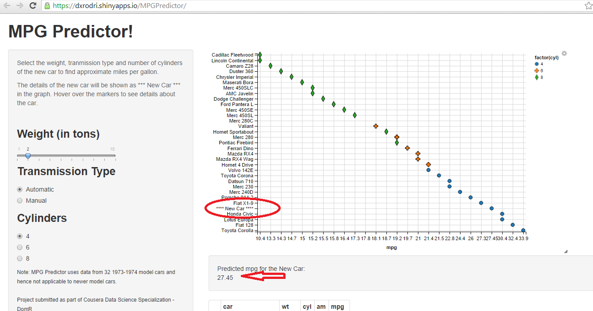

## What does _Mileage Predictor_ App do?

* _Mileage Predictor_ App predicts expected miles per gallon for the new car you are introducing to the market using regression analysis of 1973-74  data of 32 cars [mtcars dataset].
  
  
--- 
  
## How will it help you?

* Before introducing your car to the market,see how your newly designed car will stack up with other cars in the market. This will help you to price your car accordingly and/or get back to the R&D  team for design changes.


---

## How do I use it?

* Simple.

  + Visit https://dxrodri.shinyapps.io/MPGPredictor/
  + Use the slider to select the new weight, transmission type and number of cylinders for your new car
  
* The App will predict the expected mileage as well as show how your car compares to other manafactures models.  For example, expected mileage for a new 4 cylinder automatic car weighing 2 tons is 

```r
getMpg(2,0,4)[[1]]
```

```
## [1] 27.45
```

---

## Demo Please!


---

## How much does it cost?

* Free. Android and IOS based App coming soon.

<br />
<br />
<br />
<br />


### Questions?

<br />
<br />
<br />
<br />
<br />

### _Thank you._

