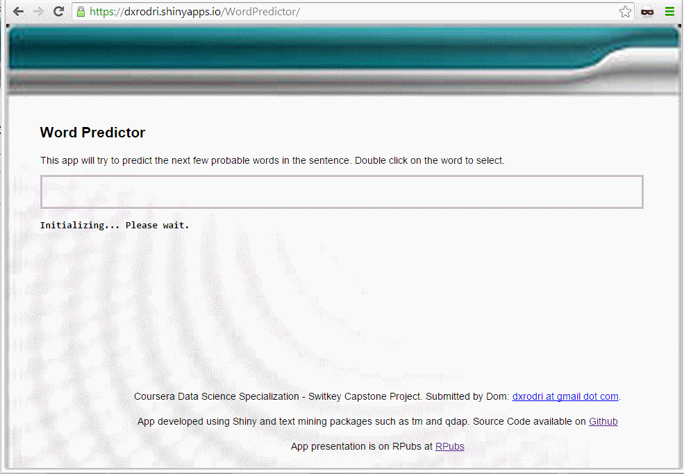

Word Predictor App
========================================================
title: "Word Predictor App!"
author: DomR 
date: December, 2014
font-family: 'Helvetica'
css: content.css
transition: rotate

<div class="footer" style="margin-top:-150px;font-size:80%;"><small> Webapp developed for Coursera Swiftkey Capstone Project.<br></small></div>

What does Word Predictor App do?
========================================================
<br/>
<br/>
* _Word Predictor_ App predicts next word based on last three words in the sentence. 
* It also suggests five likely words based on word frequencey distribution using corpus data from [Capstone Dataset](https://d396qusza40orc.cloudfront.net/dsscapstone/dataset/Coursera-SwiftKey.zip).
  
  
How does it work?
========================================================
incremental: true
<br/>
<br/>
* A sample dataset (20% of original corpus dataset) was used for building the prediction engine using R's tm package. [see sampleData.r](https://github.com/dxrodri/datasciencecoursera/tree/master/SwiftKeyCapstone).
* A lookup datagrams for bigrams, trigrams and quadgrams was build using the TermDocumentMatrix function.
* Datagrams are saved into data files and used by Shiny App to reduce application load times.[see Assignments2_V3.r](https://github.com/dxrodri/datasciencecoursera/tree/master/SwiftKeyCapstone).


How does it work (continued)? 
========================================================
incremental: true
<br/>
<br/>
* Shiny server loads processed datagrams and generates frequency as well as frequency distribution
* Smoothing techniques are applied using Simple Good Turing algorithm.
* As user types on the Shiny App user interface, the a prediction algorithms selects five  probable words given the weightage for matched grams as follows: 50% for quadrams,30% to trigrams and 20% for bigrams. [see predictFunctions_V1.r](https://github.com/dxrodri/datasciencecoursera/tree/master/SwiftKeyCapstone).

How do I use it ?
========================================================
incremental: true
<br/>
<br/>
  + Visit https://dxrodri.shinyapps.io/WordPredictor/
  + Wait for the app to initialize. Once the app is initialized, the app will display "Start Typing" message. 
  + The app will predict next probable word as your type. It will also suggest five probable words.
  + For example, if you type "guys and gals are", the app will predict the next word as terrific.

```r
nextWord <- getNextWords(wordFrameGrams,SGT, "guys and gals are")
print(nextWord)
[1] "terrific"
```

Demo of the App
========================================================
incremental: true
<br/>
<br/>

<div class="midcenter" style="margin-left:-300px; margin-top:-150px;">
</img>
</div>

Future Improvements to the app
========================================================
<br/>
<br/>
+ Use semantic analysis and part of speech
+ Expand datagram dictionary based on user inputs


Questions?
========================================================
<br/>
<br/>
<br/>
<br/>
**Thank you.**

dxrodri at gmail

